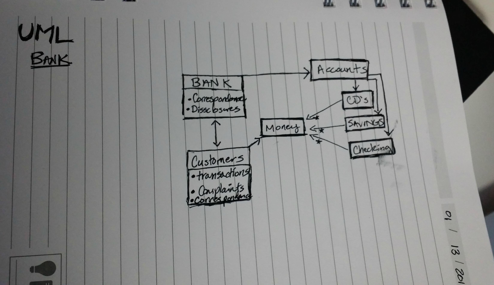

Model a Problem Domain:
I choose a Bank for this project. My classes include the Bank itself, customers, money, and accounts. A customer interacts with the bank by depositing money into an account (of which there are different types each with different/similar attributes). The bank in turn interacts with the customer by providing their goods and services (account maintnance, interest, debit cards, checks etc...). The bank and the customer also communicate to eachother with some regularity through statements, phone banking, online banking, and face to face time at the physical location.
A simple "Problem Domain" would involve the account opening process: customer --> money --> bank --> account --> correspondence between customer and bank. 

